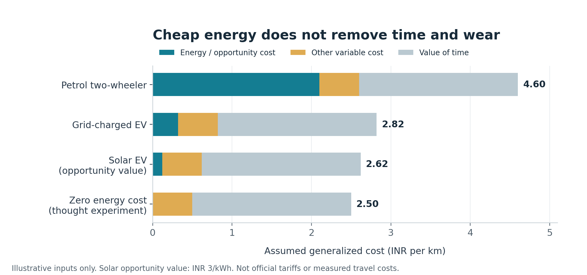
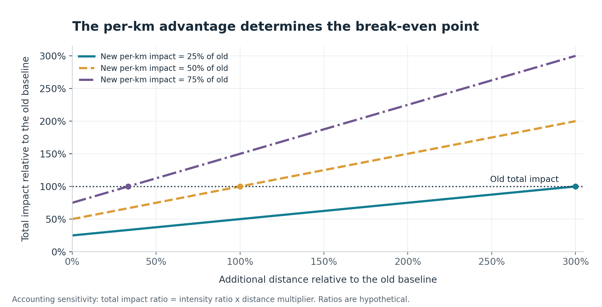

# Low-Cost Electric Mobility and Travel Rebound in Maharashtra

## A conceptual framework, illustrative scenarios and a research design for electric two-wheelers and rooftop solar

**Ajinkya**

**Independent working paper | Version 1.0.0 | 20 September 2026**

## Abstract

Electric two-wheelers and household rooftop solar may substantially reduce the salient monetary cost of travel. This paper examines how that reduction could affect travel demand in Maharashtra while distinguishing additional mobility, energy rebound, emissions and welfare. It combines a targeted reading of research and official policy documents with an accounting framework, transparent numerical scenarios and a proposed longitudinal study. No original household data are analysed. Under illustrative assumptions, switching from a petrol two-wheeler to a grid-charged electric scooter reduces energy cost by approximately 85%, but generalized travel cost by approximately 39% once assumed time and non-energy variable costs are included. Illustrative demand elasticities generate additional travel of 5.0%-27.7%; these values are sensitivity results, not estimates for Maharashtra. A separate impact-accounting model demonstrates why percentage growth in distance is not the percentage of engineering savings taken back. The policy discussion rejects automatic equivalence between rooftop solar, zero economic cost and zero-emission charging. The contribution is a reproducible framework that connects household travel decisions with explicit energy-system boundaries, mode substitution and access to opportunities. Establishing actual effects requires household-wide travel and charging measurements, credible counterfactuals and attention to unequal access to vehicle ownership and rooftops.

**Keywords:** electric two-wheelers; induced travel; rebound effect; rooftop solar; net metering; generalized cost; Maharashtra; transport accessibility.

**Research status:** Conceptual analysis and scenario modelling. No estimated causal treatment effects, original survey results or peer-review claims are made.

<!-- pagebreak -->

## 1. Introduction and contribution

A reduction in the running cost of a vehicle changes the set of journeys that its user considers affordable. In Maharashtra, electric two-wheelers combined with rooftop solar offer a concrete setting in which to study this mechanism. The original motivation is a practical observation: a journey that once required a noticeable petrol purchase may feel almost costless when charging is absorbed into a household electricity bill or offset by solar credits. That observation motivates a question; it does not establish how much additional travel occurs.

The principal research question is: **How do electric two-wheeler adoption and subsequent rooftop-solar adoption affect household travel, and under what conditions do the resulting changes improve access while preserving environmental savings?**

Three distinctions are central. First, a reduction in monetary charging expenditure is different from a reduction in generalized travel cost, which also includes time and other variable costs. Second, an increase in the use of one vehicle may reflect substitution within a household rather than new journeys. Third, financial bill offsets, physical electricity supply and lifecycle emissions are different accounting objects.

This paper contributes an integrated framework for examining those distinctions in a Maharashtra household context. It does not claim to discover the rebound effect, estimate a regional elasticity or demonstrate local economic growth. The accompanying code exposes every numerical assumption so that future observations can replace the illustrative inputs.

## 2. Evidence base and review approach

This is a targeted conceptual review, not a systematic review or meta-analysis. Sources were selected for relevance to rebound definitions, price perception, official Maharashtra rooftop-solar arrangements, environmental accounting and causal evaluation. The source register records document dates, links, access scope and the claims each source supports. Policy materials were checked on 20 September 2026; citing a dated order does not certify that every later implementation issue or legal challenge has been resolved.

Gillingham, Rapson and Wagner (2016) distinguish an efficiency improvement from the effects of a policy intervention and discuss why welfare conclusions depend on that distinction [R1]. Sorrell, Dimitropoulos and Sommerville (2009) review direct rebound estimates and methodological problems in household energy services [R2]. Neither review supplies an estimate for contemporary solar-owning electric-scooter households in Maharashtra. A numerical rebound value should not be imported from another country or vehicle class without justification.

Shampanier, Mazar and Ariely (2007) examine choices involving zero-priced consumer goods [R3]. Their results motivate a possible role for "free charging" perceptions. They do not demonstrate that such perceptions dominate actual transport choices. This paper treats that transfer between domains as a testable hypothesis.

<!-- pagebreak -->

## 3. Definitions and system boundaries

**EV-induced travel** denotes a causal increase in travel associated with EV adoption. It can arise from operating-cost changes, convenience, reliability, performance or household vehicle availability. The narrower expression **direct energy rebound** refers to increased use that offsets energy savings from an efficiency improvement. A combined vehicle-and-fuel switch also changes energy prices, so all observed distance growth should not automatically be attributed to efficiency alone.

Let D0 denote baseline annual distance, D1 distance after a change, and e0 and e1 comparable energy intensities. Define r as the proportional distance increase and q as the new-to-old intensity ratio:

$$
r = \frac{D_1-D_0}{D_0}, \qquad q = \frac{e_1}{e_0}
$$

Holding distance fixed, the engineering baseline after the change is e1D0. Actual use is e1D1. Where e1 is below e0, the finite-change proportion of expected savings taken back is:

$$
R_E = \frac{e_1D_1-e_1D_0}{e_0D_0-e_1D_0} = \frac{qr}{1-q}
$$

The accounting identity can be calculated for a scenario; calling it a causal rebound estimate additionally requires evidence that the extra distance resulted from the relevant cost or efficiency change. Observed before-and-after growth is insufficient.

An illustrative q of 0.25 and r of 0.25 gives an energy rebound of 0.0833, or 8.3%, while actual energy use is 31.25% of the original baseline. Thus 25% extra distance does not mean 25% of engineering savings were lost. The measure is undefined if there was no engineering saving to begin with.

Backfire for the selected impact occurs when the new total exceeds the old total:

$$
q(1+r)>1 \qquad \Longleftrightarrow \qquad r>\frac{1}{q}-1
$$

This is a threshold within a specified boundary, not proof of economy-wide Jevons' paradox. Electricity consumption can rise as petrol consumption falls; those observations alone do not establish a rise in total energy use. A comparison must select a common basis, such as final energy or primary energy, and disclose the conversion convention.

Indirect spending of saved money and wider price, production or innovation responses are outside the numerical model. They remain relevant to an economy-wide evaluation.

<!-- pagebreak -->

## 4. A household travel-cost framework

For a marginal travel decision, define generalized cost per kilometre as:

$$
G = pe + v + t
$$

Here p is the relevant energy price or opportunity value, e is energy consumed per kilometre, v is non-energy variable cost and t is the money-equivalent value of time per kilometre. Route-specific parking, tolls and charging delays can be added. Fixed purchase and insurance costs belong in an ownership analysis; allocating them mechanically to each extra trip can confuse a sunk cost with an avoidable one. Mileage-related depreciation can enter v.

For an EV, e should preferably be measured at the charging point, including charging losses, rather than inferred only from the dashboard. For solar electricity, p is not necessarily zero: the relevant alternative can be export compensation, usable credits or another household load. The value may be low when surplus would otherwise be curtailed or a credit would expire unused. It can be higher when charging consumes energy that would displace a future grid purchase.

Actual private cost and **perceived** private cost should be recorded separately. A rider may notice the electricity payment but overlook tyre wear or the value of a billing credit. Conversely, charging inconvenience may dominate the electricity saving. A price-salience mechanism is therefore plausible without assuming unlimited travel or a universal psychological response.

For illustration only, let distance respond to generalized cost through a constant-elasticity relationship:

$$
\frac{D_1}{D_0}=\left(\frac{G_1}{G_0}\right)^{\varepsilon}, \qquad \varepsilon<0
$$

This is a transparent sensitivity device, not a fitted demand function. Its elasticity concerns the whole generalized cost, not electricity price alone. Extrapolating a fuel-price elasticity to a large technology transition would conflate different parameters and mechanisms. Even this broader relationship can fail over large changes because of travel-time budgets, saturation, charging capacity and trip-specific needs.

A positive t and v keep G above zero when the energy component reaches zero. The model therefore avoids the singular prediction obtained by extending a fuel-only constant-elasticity equation to a zero fuel price. Equal non-energy and time costs across the illustrative cases isolate the energy-price mechanism; they are not an empirical claim about petrol and electric vehicles.

<!-- pagebreak -->

## 5. Maharashtra rooftop solar: a bounded policy reading

Official documents provide an institutional setting for the hypothesis, rather than evidence that a particular behavioural effect has occurred.

| Policy issue | Source-grounded reading | Consequence for this paper |
| --- | --- | --- |
| System capacity | The 2019 rooftop regulations link capacity to sanctioned load or contract demand. [R4, regulation 6.2] | Historical kWh consumption and sanctioned kW load must not be treated as the same quantity. |
| Small-system approval | MSEDCL's 5 July 2024 circular provides deemed feasibility approval and an automatic load-enhancement process up to 10 kW, with applicable payments. [R7] | EV ownership is not an established legal prerequisite for this process. |
| Household assistance | MSEDCL displays the standard PM Surya Ghar schedule: INR 30,000/kW for the first 2 kW and INR 18,000 for the third; total assistance is capped at INR 78,000. [R6] | More EV consumption does not imply indefinitely increasing household subsidy. |
| Grid-support charges | The 2019 regulation uses sanctioned load up to 10 kW for the net-metering exemption; the 25 March 2026 order reiterates the small-load exemption. [R4, regulation 11.5; R5, paragraphs 21.12-21.14] | A claim based solely on panel nameplate capacity is incomplete. |

The paper does not model a specific household bill. A defensible bill model would require the operative consumer category, approved capacity, import and export readings, applicable time slots, fixed charges and treatment of surplus or banked units. Rules for open-access projects and residential net-metering arrangements must be distinguished. The 2026 order is cited narrowly for its grid-support discussion, not used to infer a universal overnight set-off entitlement.

The phrase "grid as a free battery" can obscure both economics and physics. Net metering can provide an accounting credit; it does not store a household's daytime electrons for its own use at night. A reduction in the bill therefore does not, by itself, establish zero marginal emissions.

Finally, subsidy reduces the household's upfront payment but does not erase the resources needed to produce or maintain panels, inverters and batteries. It also creates a public-budget cost. A social appraisal must distinguish a financial transfer from a net saving of real resources.

<!-- pagebreak -->

## 6. Illustrative cost and demand scenarios

Table 1 records assumed inputs. They were selected to make the arithmetic inspectable, not fitted to a rider or chosen as current Maharashtra market values. The solar opportunity price is not an official export tariff. Electricity use is wall-measured by definition, so charging losses should not be added a second time.

**Table 1. Scenario assumptions**

| Input | Assumption | Unit or interpretation |
| --- | --- | --- |
| Baseline distance | 10,000 | km/year |
| Petrol price | 105 | INR/litre |
| Petrol efficiency | 50 | km/litre |
| EV wall energy intensity | 0.04 | kWh/km, or 4 kWh/100 km |
| Grid energy price | 8 | INR/kWh |
| Solar opportunity value | 3 | INR/kWh |
| Other variable cost | 0.50 | INR/km in every case |
| Time cost | 2.00 | INR/km in every case |
| Generalized-cost elasticities | -0.1, -0.3, -0.5 | Assumed sensitivity values |

**Figure 1.** Arithmetic cost scenarios. The thought experiment removes the energy component only. No vehicle purchase-cost comparison or tariff forecast is implied.

<!-- pagebreak -->

The petrol energy component is INR 2.10/km and the grid-electric component INR 0.32/km. Their reduction is 84.8%. Adding the assumed INR 2.50/km of non-energy and time cost changes generalized cost from INR 4.60/km to INR 2.82/km, a 38.7% reduction. With the assumed solar opportunity value it becomes INR 2.62/km; with a zero energy component it is INR 2.50/km.

**Table 2. Additional distance relative to the petrol scenario**

| Scenario | Elasticity -0.1 | Elasticity -0.3 | Elasticity -0.5 |
| --- | --- | --- | --- |
| Grid-charged EV | 5.0% | 15.8% | 27.7% |
| Solar EV, opportunity cost included | 5.8% | 18.4% | 32.5% |
| Zero energy cost thought experiment | 6.3% | 20.1% | 35.6% |

These are conditional mathematical outputs, not confidence intervals, survey findings or predictions. The elasticity values have not been estimated from the cited literature. Different assumptions about time, charging inconvenience or vehicle wear could shift them substantially. The small gap between the final two rows illustrates the importance of non-energy constraints; it does not rule out a separate psychological response to the word "free".

## 7. Impact accounting and environmental interpretation

Let q now denote the new-to-old **emissions intensity** ratio measured on a comparable basis. This is separate from the energy-intensity ratio in section 3: electricity's supply mix can change emissions without changing the scooter's kWh/km. The simple ratio of new to old emissions is q(1+r).

**Table 3. Extra distance at which a hypothetical per-km advantage is exhausted**

| New emissions intensity / old intensity | Distance multiplier at equality | Extra distance at equality |
| --- | --- | --- |
| 0.25 | 4.00 times | 300.0% |
| 0.50 | 2.00 times | 100.0% |
| 0.75 | 1.33 times | 33.3% |

The model does not estimate any of these ratios for Maharashtra. They are alternative assumptions that reveal the dependence of the conclusion on technology and system boundaries. Equality is the break-even point; backfire requires exceeding it. A small per-kilometre advantage is exhausted with less additional travel than a large advantage.

<!-- pagebreak -->

**Figure 2.** Hypothetical intensity ratios held constant. The dashed line is the old total impact. These curves describe accounting identities and should not be read as regional forecasts.

The constant-intensity illustration is most straightforward for a consistently bounded operating-impact measure. Lifecycle impacts need more care because manufacturing is partly fixed. For a specified assessment horizon, use:

$$
H_0=M_0+u_0D_0, \qquad H_1=M_1+u_1D_1
$$

M denotes embodied impacts allocated consistently to the decision and horizon; u denotes use-phase impact per kilometre. If more travel changes replacement timing or requires another battery, M1 can also change. The future impact of continuing to use an existing petrol vehicle differs from a comparison of two newly manufactured alternatives. The US EPA's lifecycle discussion supports this distinction, but supplies no Maharashtra two-wheeler values here [R9].

A grid-connected solar case also needs a counterfactual for the solar installation. If the same panels would have been installed without the EV, their entire generation benefit cannot automatically be attributed to EV adoption. If the EV causes additional solar capacity, the additional generation and embodied impacts should be evaluated. Daytime self-consumption can reduce exports that would otherwise displace grid generation; this opportunity must not be counted twice.

Use time-specific marginal electricity emissions for the question "what emissions does an extra charging session cause?" An average grid factor answers a different inventory question. When marginal data are unavailable, report a sensitivity range and its limitations rather than setting night-time charging emissions to zero because of annual credits.

<!-- pagebreak -->

## 8. Mode substitution, accessibility and welfare

The relevant observational unit is usually the household and its complete travel portfolio. A second vehicle can shift distance from an existing petrol vehicle without increasing aggregate household distance. Replacing a car trip with a scooter trip also changes passenger capacity, comfort and exposure to road risk; distance alone is an incomplete service measure. Vehicle-kilometres and passenger-kilometres should both be reported when occupancy changes.

Each additional EV trip should be classified by its likely counterfactual: petrol vehicle, public transport, walking or cycling, another destination, a remote activity, or no trip. Self-reported alternatives are imperfect and should be accompanied by confidence ratings and comparison with diaries. Avoided transit emissions are not always the average emissions of the bus: one passenger's decision may not change the service in the short run, while aggregate demand may alter it over time.

Mobility can increase access to employment, education, health services, markets and social relationships. These are candidate benefits, including when a trip is recreational. Their existence should not be inferred solely from kilometres. Relevant outcomes include destinations reachable within a time-and-money budget, missed appointments, job-search opportunities, net earnings and subjective access satisfaction.

A welfare appraisal weighs users' benefits against vehicle and energy resource costs, time, infrastructure, congestion, safety, pollution and public financing costs. Subsidy payments and local spending should not be counted as benefits without considering who pays and what is displaced. A trip can benefit the traveller while imposing costs on others.

The original draft linked a cross-country energy-GDP chart to a local growth claim. That inference is not identified. Income can affect energy demand, energy access can affect production, and infrastructure or industrial structure can influence both. A cross-sectional association cannot establish that extra scooter travel increases local output. This paper therefore evaluates access as a measurable intermediate outcome and leaves aggregate growth as an untested longer-run question.

Distribution also matters. Households with secure rooftop access, capital, suitable wiring and predictable parking may capture different benefits from renters or people who rely on public transport. A programme may lower an adopter's mobility cost while leaving non-adopters' constraints largely unchanged. These effects should be measured rather than assumed to cancel.

<!-- pagebreak -->

## 9. Proposed empirical study

### 9.1 Estimands and hypotheses

Estimate two distinct effects: the effect of adopting an electric two-wheeler on household travel, and the additional effect of adopting rooftop solar among existing EV households. Track the sequence of adoption; simultaneous purchases do not identify the two components separately.

- **H1:** EV adoption increases household motorised travel when the reduction in generalized cost relaxes a binding travel constraint.
- **H2:** Among EV owners, solar adoption changes travel in proportion to changes in effective and perceived charging costs, conditional on other constraints.
- **H3:** Increases in EV distance exceed increases in total household distance when substantial within-household substitution occurs.
- **H4:** Access outcomes improve most where previously suppressed journeys served valued activities; the relationship with kilometres is heterogeneous.

The hypotheses allow null or negative effects. Range limitations, additional charging time, changed employment or reduced vehicle availability can outweigh energy savings. H2's framing mechanism requires evidence beyond observing lower bills.

### 9.2 Sampling and measurement

Recruit households before adoption where feasible, including non-adopters and households adopting at different times. Seek diversity in income, urban or rural location, household size, baseline travel, vehicle portfolio, rooftop tenure and access to charging. A convenience sample can support exploratory work but not population-wide claims.

An aspirational panel would observe at least three months before adoption and twelve months afterward to cover seasonal changes; feasibility should be evaluated in a pilot. Determine sample size from a power analysis using pilot variation, within-household dependence, expected attrition and a prespecified minimum effect of interest. No arbitrary sample size is asserted to be sufficient.

| Domain | Measurements |
| --- | --- |
| All household travel | Odometers, journey diaries, mode, distance, occupants, purpose and likely alternative |
| Energy and charging | Wall kWh, timing, location, price, public-charging fees and petrol purchases |
| Solar and billing | Commissioning date, capacity, generation, imports, exports and actual credit treatment |
| Confounders | Employment, income, relocation, school schedules, weather and vehicle additions or losses |
| Outcomes beyond distance | Access to destinations, net travel expenditure, journey time and foregone activities |

<!-- pagebreak -->

### 9.3 Identification and analysis

A simple pre-post comparison cannot separate adoption from changed work patterns, income or seasonality. Compare treated households with suitable not-yet-treated or never-treated households and examine pre-adoption trends. For staggered adoption, group-time treatment-effect methods such as Callaway and Sant'Anna (2021) avoid treating every two-way fixed-effects coefficient as a valid common effect [R8].

Identification still requires defensible assumptions: conditional parallel trends, no anticipation affecting the chosen baseline, appropriate comparison groups and limited spillovers. A plot showing statistically insignificant pre-trends does not prove these assumptions. Prospective adopters may already be planning longer commutes, and solar adoption is strongly selected by housing and resources.

Pre-register the primary household-distance outcome, secondary access outcomes, exclusion rules, missing-data treatment and planned subgroups. Report effect estimates with uncertainty, attrition diagnostics and robustness to alternative baselines. Cluster uncertainty at the level justified by assignment and dependence. Treat income, employment or other variables affected by adoption as potential outcomes or mediators rather than automatically controlling them away.

To study price perception, a separate randomized information intervention could present truthful descriptions of charging costs to consenting EV-owning households. It should compare equivalent factual information presented with different salience and measure perceived cost before measuring any travel response. It would identify the effect of that communication, not the total effect of EV or solar adoption. A hypothetical vignette would provide weaker evidence about actual behaviour.

### 9.4 Data governance and feasibility

Obtain informed consent and appropriate ethics review before collecting identifiable participant data. Precise location histories can reveal sensitive routines. Collect the minimum needed, separate identities from research records, restrict access, define retention periods and publish only sufficiently anonymised or aggregated outputs. A personal self-observation pilot should be labelled as such and should not be represented as a causal population study.

The present repository contains assumptions and generated scenarios only. No household observations or participant records are included. The study described above is a proposal; it has not been conducted or registered.

## 10. Limitations

The review is selective and cannot establish a complete evidence inventory. Scenario prices, efficiencies, cost components, elasticities and impact ratios are assumptions. The cost-response relationship is not calibrated and holds non-energy attributes fixed. Policy eligibility and realized billing remain household-specific. The model excludes economy-wide indirect rebound, congestion feedback and endogenous replacement except where discussed conceptually. Its scope is primarily personal two-wheeler mobility; application to cars or commercial fleets requires separate inputs and design.

<!-- pagebreak -->

## 11. Conclusion

Electric two-wheelers and rooftop solar provide a plausible setting for studying how low and low-salience energy costs influence mobility. The defensible claim is conditional: lower generalized travel cost can increase travel, but the size, cause and value of that increase must be measured. More kilometres do not automatically imply emissions backfire, and reduced charging expenditure does not automatically imply zero economic or environmental cost.

The practical contribution is a set of explicit definitions, accounting identities, reproducible illustrations and a proposed empirical design. A next version with household-wide longitudinal evidence could test whether additional journeys expand valued access, substitute for existing travel or mainly increase external costs. Until then, the appropriate output is a transparent working paper and research agenda.

## Reproducibility and declarations

The repository supplies `analysis/assumptions.json`, the standard-library script `analysis/reproduce.py`, generated CSV results, figure code and editable Markdown for both editions. `analysis/check_model.py` checks arithmetic identities, break-even conditions and the zero-energy-cost boundary. These checks validate implementation, not empirical assumptions.

**Contributions and AI assistance.** The author supplied the original concept and draft. OpenAI ChatGPT assisted with source discovery, critical restructuring, drafting, scenario coding and document production. This version includes substantial AI assistance. It should be represented as such in any setting requiring disclosure. The paper does not assert that the author has independently validated every source or calculation.

**Data and review status.** No original human-participant data are analysed. This working paper has not undergone peer review. GitHub publication provides versioned public access; it is not journal acceptance. No institutional affiliation, external funding or independent endorsement is claimed.

<!-- pagebreak -->

## References

**[R1]** Gillingham, K., Rapson, D., & Wagner, G. (2016). The Rebound Effect and Energy Efficiency Policy. *Review of Environmental Economics and Policy, 10*(1), 68-88. [DOI: 10.1093/reep/rev017](https://doi.org/10.1093/reep/rev017). Earlier [RFF working-paper page](https://www.rff.org/publications/working-papers/the-rebound-effect-and-energy-efficiency-policy/) provides an accessible overview.

**[R2]** Sorrell, S., Dimitropoulos, J., & Sommerville, M. (2009). Empirical estimates of the direct rebound effect: A review. *Energy Policy, 37*(4), 1356-1371. [DOI: 10.1016/j.enpol.2008.11.026](https://doi.org/10.1016/j.enpol.2008.11.026). [University of Sussex record](https://sussex.figshare.com/articles/journal_contribution/Empirical_estimates_of_the_direct_rebound_effect_A_review/23330324).

**[R3]** Shampanier, K., Mazar, N., & Ariely, D. (2007). Zero as a Special Price: The True Value of Free Products. *Marketing Science, 26*(6), 742-757. [DOI: 10.1287/mksc.1060.0254](https://doi.org/10.1287/mksc.1060.0254).

**[R4]** Maharashtra Electricity Regulatory Commission. (2019). *Grid Interactive Rooftop Renewable Energy Generating Systems Regulations, 2019*. Regulations 6.2 and 11.5. [Official PDF hosted by MSEDCL](https://www.mahadiscom.in/consumer/wp-content/uploads/2020/01/Grid-Interactive-RRE-Regulations2019-English.pdf). Read together with applicable later amendments and orders.

**[R5]** Maharashtra Electricity Regulatory Commission. (2026, March 25). *Order in Case No. 75 of 2025: Post-remand proceedings*. Paragraphs 21.6-21.14, pp. 83-84. [Official order](https://www.mahadiscom.in/wp-content/uploads/2026/07/Tariff-Order_Case-No.-75-of-2025-dated-25th-March-2026.pdf).

**[R6]** Maharashtra State Electricity Distribution Company Limited. (n.d.). *I-SMART portal: PM Surya Ghar Muft Bijli Yojana subsidy section*. [Official portal](https://portal.mahadiscom.in/ismart/index.php). Accessed 20 September 2026. The current scheme section is distinguished from legacy subsidy material elsewhere on the same page.

**[R7]** Maharashtra State Electricity Distribution Company Limited. (2024, July 5). *Auto approval (deemed approval) of technical feasibility up to 10 kWp and load enhancement up to 10 kW*. Circular CE(SPD)/RTS/TFR/20949. [Official circular](https://portal.mahadiscom.in/ismart/media/AUTO%20APPROVAL%2010.pdf).

**[R8]** Callaway, B., & Sant'Anna, P. H. C. (2021). Difference-in-Differences with multiple time periods. *Journal of Econometrics, 225*(2), 200-230. [DOI: 10.1016/j.jeconom.2020.12.001](https://doi.org/10.1016/j.jeconom.2020.12.001). [Accessible author manuscript](https://arxiv.org/abs/1803.09015).

**[R9]** United States Environmental Protection Agency. (n.d.). *Electric Vehicle Myths*. [Official explanatory resource](https://www.epa.gov/greenvehicles/electric-vehicle-myths). Accessed 20 September 2026. Used for the distinction between tailpipe, electricity-generation and manufacturing impacts, not for Indian vehicle estimates.
